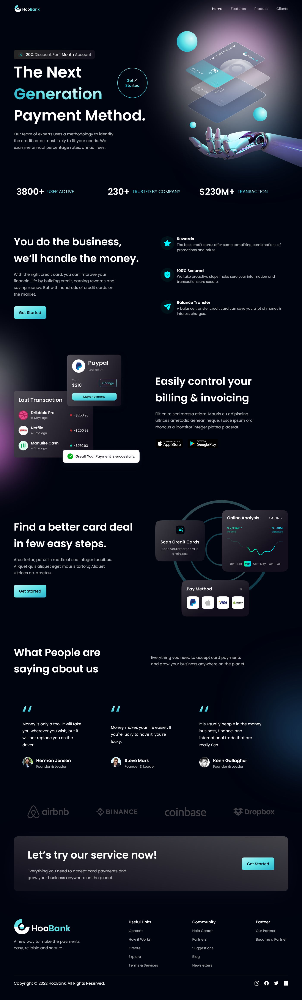

<h1 align="center">
  Responsive Bank Website 🌱 
  <a href="https://bank-main-vlad-ts.netlify.app/" target="_blank">HooBank</a>
</h1>

 

  

### Responsive Bank Website 🌱

- Modern UI/UX website using React.js & Tailwind CSS
- Developed first with the Mobile First methodology, then for desktop.
- Compatible with all mobile devices and with a beautiful and pleasant user interface.

